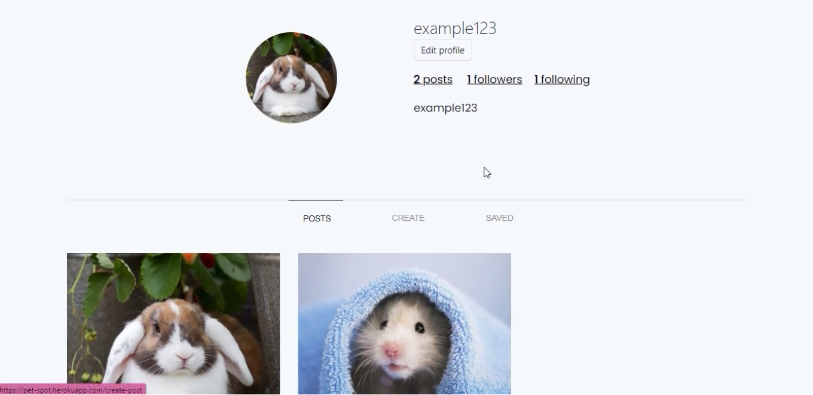

# PetSpot

Social Network application for Pet Owners to share photos of their adorable pets.

Frontend uses React Bootstrap framework to build user interface. Backend uses ExpressJS for server framework.

This platform provide features like -  Posting photos, Saving good posts, Allow comments, Give likes, Follow & Unfollow pet owners, Search for pet owners, View gallery of images inspired from Pinterest and Option to update your profile.

**Checkout live website in the description! It may take some time to load because of shared instances.**


## Tech Stack - MERN

-   MongoDB
-   Mongoose
-   Express
-   React
    -   React Redux
    -   React Bootstrap
-   Cloudinary
-   Gravatar
-   Axios
-   JWT

## Run locally


### Clone or Download


First clone the repository from Github :
```
$ git clone https://github.com/amifunny/PetSpot.git
```

### Backend

Enter into backend folder  `backend/`

```
$ cd backend
```

Install npm dependencies -
```
$ npm install
```

Run development server using -
```
$ npm start
```

#### Add environment variable

 - Add Cloudinary API Key
 - Add MongoDB Atlas url with authentication

### Frontend


Enter into backend folder  `frontend/`

```
$ cd frontend
```

Install npm dependencies -
```
$ npm install
```

Run development server using -
```
$ npm start
```

### Launching

Run and deploy application after building frontend static files
```
$ npm run build
```

If build succeeds, you can run both frontend and backend together using -

```
$ node backend/server
```

## Screenshots



